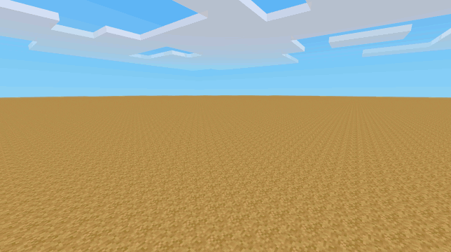
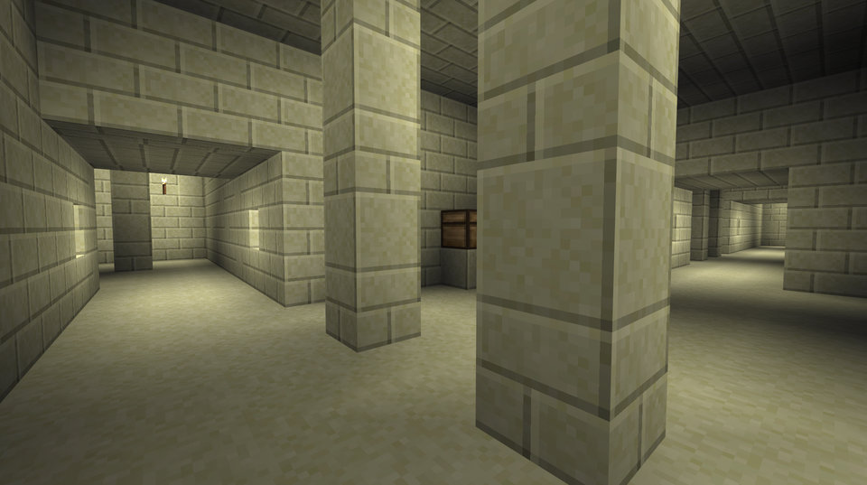

# Structure Generator for Minetest

*(A work in progress, but feedback and use and prefab artistry will help)*

Function for mods to procedurally generate 
* fortresses
* Elven treehouse villages
* strongholds
* floating villages (on water)
* ruins, dungeons
* end-cities, Kowloon Walled cities
* temples, pyramid interiors
* mines, sewers, mazes, etc.

i.e. these can do so much more than just dungeons, but I was in a hurry so the example structure is unfortunately just a dungeon.

A non-Minetest [video explaining the general concept is here](https://www.youtube.com/watch?v=rfKcpp8UDQ0), not Minetest but it's the same concept of creating prefab parts with sets of connection points and probabilities. (That guy is also doing a dungeon, I swear these can create more than that!)

The mod has two main parts:
* Prefab creation tools (chat-commands)
* The `structure_generator_lib.lua` library you copy into your mod

A demo magic wand that builds structures is also provided - use a map with a dummy backend if you're going to play with the wand, or a map you don't care about. With great power comes great responsibility.

The prefab creation tools are used to create the structure data and make it easy to edit your schematics inside Minetest and be able to export them. You would copy the generated data into your mod along with `structure_generator_lib.lua` to enable the mod to create large procedural structures (once there's better documentation).

Scaffolding commands to quickly turn [a Lua list of rooms and decorations](https://github.com/Treer/structure_generator/blob/master/example_ready_to_scaffold.lua) into an editable Minetest world that can be automatically exported to a folder of .mts schematics:

[Those pink things in the last frame are connection-point markers, so the connection point coords can be exported]

Then call `build_structure()` from within your Lua code, or create havoc with the magic wand.

[Pretend this is a screenshot of something grander than a dungeon]

The example uses nodes from Minetest game, but structure_generator_lib.lua doesn't have any dependencies, nor do the prefab scaffolding commands.

To try it out
* Create a new flat world, set it to Creative, and enable this mod in it. 
* `/grantme all`
* Stand near 0, 0
* `/scaffold_prefabs`
* `/fill_floors default:sandstone`
* `/fill_ceailing default:sandstone_block`
* `/fill_walls default:sandstonebrick`
* In the Creative inventory, search for "struct" to bring up all the nodes this mod provides
* Edit the "prefab" sections of your structure, add doors etc.
  * Add Connection marker nodes to specify where these prefabs may join to other,
  * Add Decoration marker nodes to specify where decorative prefabs should be placed,
* `/export_prefabs`

Now the world you created has a `/schems` directory containing schematics for all the prefabs you created, and an `example_ready_to_build.lua` file to register them with the structure generator.

The example lua file it generates in your world/schems directory is not 100% ready to build with, you'll need to decide which prefabs can connect to what, with what probabilities, specify types for connection points (e.g. so a 3x3 doorway doesn't connect to a 1x2 hallway), etc. Look to the `example_ready_to_build.lua` file in this mod for a registration file that actually works (it powers the magic wand).

The example Lua file it generates in your world/schems directory is not 100% ready to build with, you'll need to decide which prefabs can connect to what, with what probabilities, specify types for connection points (e.g. so a 3x3 doorway doesn't connect to a 1x2 hallway), etc. and I haven't written documentation yet. Look to the [example_ready_to_build.lua](https://github.com/Treer/structure_generator/blob/master/example_ready_to_build.lua) file in this mod for a finished registration file that actually works (it powers the magic wand).

This is still very Work In Progress, it needs much better documentation, and there are lots of advanced features it'd be nice to add, IMO the scaffolding system is good enough now to start creating the building pieces, once you get the hang of it.

**Tips:**
* `/scaffold_prefabs` will apply any .mts files that were saved, so keep those up to date with `/export_prefabs`
* Most of the scaffolding functions will avoid overwriting blocks (`/cleararea` is an exception), so you can still `/scaffold_prefabs` after you've started building - just make sure any .mts files are up to date.
* Add new buildings to the end of the scaffold.lua file to avoid `/scaffold_prefabs` changing which buildings are where - as the map won't change.

**Documentation:** Currently in the [wiki](https://github.com/Treer/structure_generator/wiki).

**Forum:** [thread](https://forum.minetest.net/viewtopic.php?t=27173)

**License:**
[LGPL v3](https://www.gnu.org/licenses/lgpl-3.0) for code & config, [Attribution-ShareAlike 4.0 International](http://creativecommons.org/licenses/by-sa/4.0/) for text and media. Other licenses available on request.

